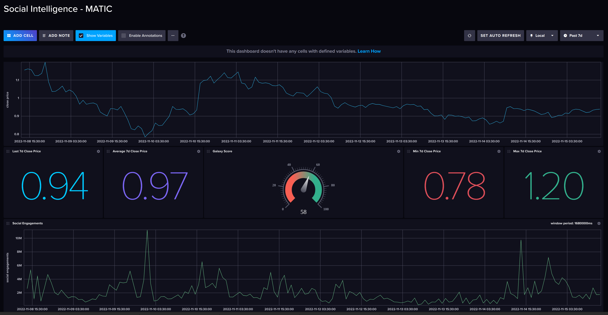

# Social Intelligence

This project collects social and market activity for thousands of cryptocurrencies. 
Nowadays cryptocurrencies are too popular among the people of the world.
The conventional idea that Satoshi made makes our financial system more efficient.

Developers and engineers make recently many powerful tokens. As you already know we are at 
the edge of changing U.S monetary policies, we would see a lot of crypto token price pumps in the near future 
but, the question remains:

## Which Token and When?
You are helped by monitoring these social data such as social volumes, mentions, engagements, rankings, and ... 
Hence your win rate is increased by analyzing these data.

After a massive rise in social engagements of Matic (2022-11-10 03:30:00), the price of Matic raised by more than 30%.
